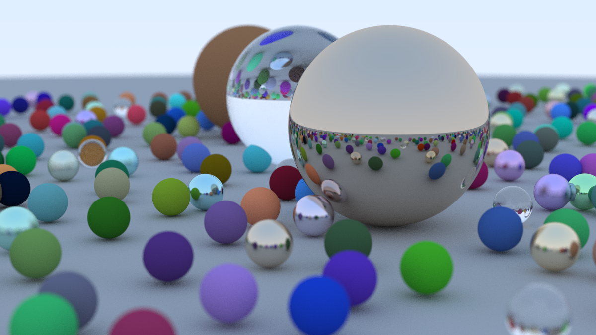

# CPU Ray Tracer Written in Rust
by Emilia Wilson

# Implementation
The implementation of the ray tracer follows [_Ray Tracing in One Weekend_](https://raytracing.github.io/books/RayTracingInOneWeekend.html) guide. It is adapted to be written in Rust. 

# Improvements
* Refactor a lot of the code, as I started with minimal rust knowledge and learned better ways to implement things as time went on.
* Make parallel so decrease run-time.
* Implement on GPU. 
